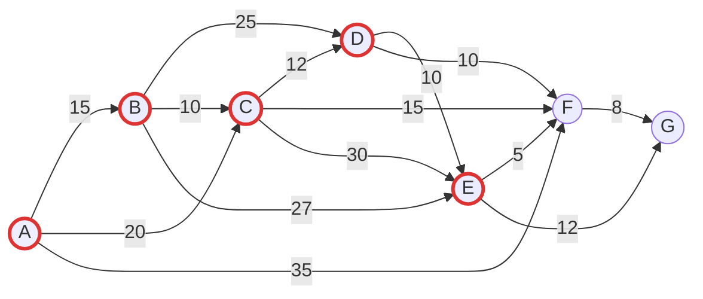

# Diagramas (Mermaid)

Este archivo contiene diagramas en formato **Mermaid** para visualizar:
1. El grafo de ubicaciones y tiempos (minutos)
2. El flujo del algoritmo de Dijkstra

Puedes previsualizarlos en VS Code (extensión Mermaid) o en sitios como https://mermaid.live

---
## Grafo de rutas



---
## Flujo del algoritmo de Dijkstra

```mermaid
flowchart TD
  Start([Inicio]) --> Init["Inicializar distancias:\n dist[origen]=0, resto=∞\n padres=null\n push (0, origen)"]
  Init --> Loop{¿Cola vacía?}
  Loop -->|No| Pop[Extraer (d, nodo) menor]
  Loop -->|Sí| Done([Fin bucle])
  Pop --> Check{d > dist[nodo]?}
  Check -->|Sí| Loop
  Check -->|No| ForEach[Para cada (vecino, peso)]
  ForEach --> Relax{¿d + peso < dist[vecino]?}
  Relax -->|No| Next[Vecino siguiente]
  Relax -->|Sí| Update[Actualizar dist[vecino]\n padres[vecino]=nodo\n push(nuevaDist, vecino)]
  Update --> Next
  Next --> AfterNeighbors[Vecinos procesados]
  AfterNeighbors --> Loop
  Done --> Reconstruct[Reconstruir ruta usando padres[]]
  Reconstruct --> End([Resultado])

  classDef action fill:#eef,stroke:#369,stroke-width:1px;
  classDef decision fill:#ffd,stroke:#c90,stroke-width:1px;
  classDef startend fill:#ddf,stroke:#334,stroke-width:2px;

  class Start,End,Done startend;
  class Init,Pop,ForEach,Update,Reconstruct,AfterNeighbors action;
  class Loop,Check,Relax decision;
```

---
## Nota rápida
- "Relajar" = intentar mejorar la distancia a un vecino.
- El mapa de padres permite reconstruir la ruta al final.
- La cola de prioridad siempre da el siguiente nodo más prometedor.

¡Si quieres más variantes (por ejemplo versión BFS o Floyd-Warshall en Mermaid) dímelo! :)
