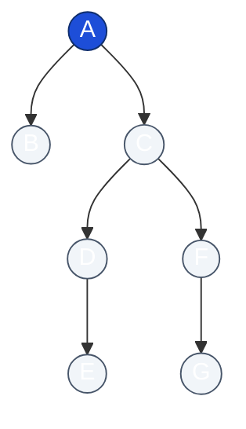
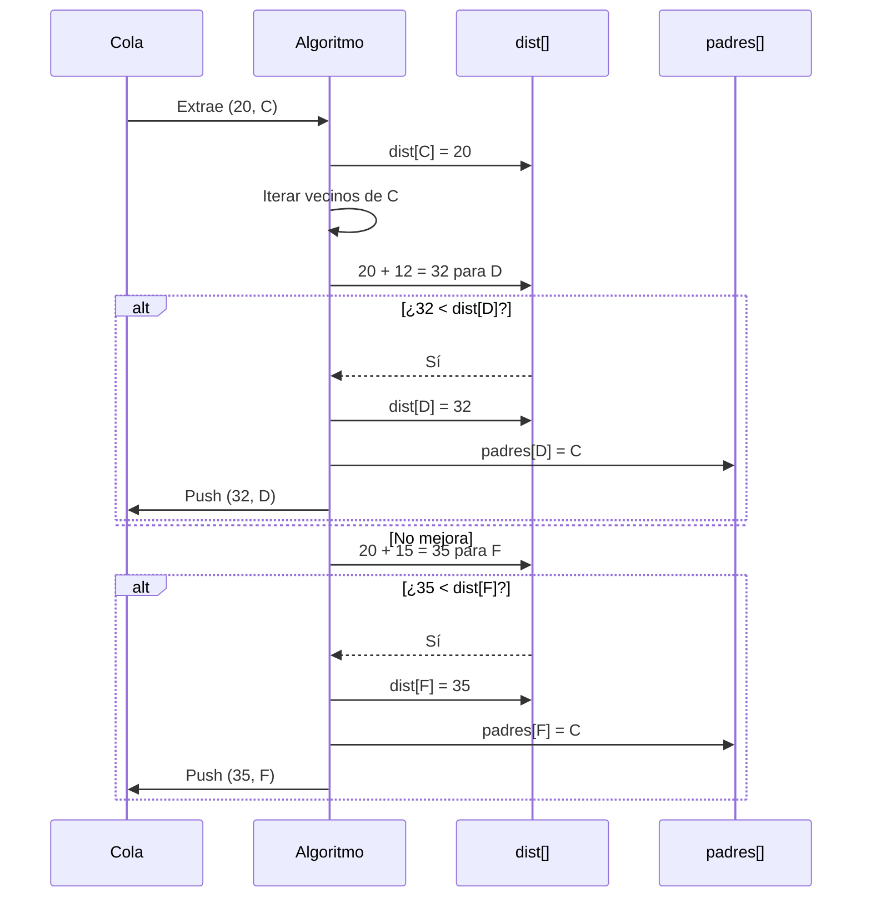

# Diagramas (Mermaid)

Este archivo reúne diagramas para explicar el problema de rutas y el algoritmo de Dijkstra de varias formas (estructura, flujo, árbol de padres y una vista micro de la relajación).

Índice:
1. Grafo de rutas (versión original)
2. Flujo de Dijkstra (básico)
3. Grafo de rutas (versión mejorada y estilizada)
4. Árbol de caminos mínimos (Shortest Path Tree) desde A
5. Secuencia de relajaciones (vista micro en nodo C)
6. Flujo de Dijkstra (detallado + complejidad)
7. Nota rápida

Puedes previsualizarlos en VS Code o en https://mermaid.live

---
## 1. Grafo de rutas (versión original)

```mermaid
graph LR
  A((A)):::start -->|15| B((B))
  A -->|20| C((C))
  A -->|35| F((F))
  B -->|25| D((D))
  B -->|10| C
  B -->|27| E((E))
  C -->|12| D
  C -->|15| F
  C -->|30| E
  D -->|10| E
  D -->|10| F
  E -->|5| F
  E -->|12| G((G))
  F -->|8| G

  %% Destacar rutas clave
  classDef highlight stroke:#d33,stroke-width:3px;
  class A,C,D highlight;  %% Ruta mínima A->C->D
  class B,E highlight;    %% B->E directa

  %% Leyenda (comentarios)
  %% A: Aeropuerto | B: Terminal | C: Simón Bolivar
  %% D: Museo del Oro | E: Monserrate | F: Zona T | G: EAN

  classDef start fill:#eef,stroke:#336;
```

---
## 2. Flujo del algoritmo de Dijkstra (básico)

```mermaid
flowchart TD
  Start([Inicio]) --> Init["Inicializar distancias:\n dist[origen]=0, resto=∞\n padres=null\n push (0, origen)"]
  Init --> Loop{¿Cola vacía?}
  Loop -->|No| Pop[Extraer (d, nodo) menor]
  Loop -->|Sí| Done([Fin bucle])
  Pop --> Check{d > dist[nodo]?}
  Check -->|Sí| Loop
  Check -->|No| ForEach[Para cada (vecino, peso)]
  ForEach --> Relax{¿d + peso < dist[vecino]?}
  Relax -->|No| Next[Vecino siguiente]
  Relax -->|Sí| Update[Actualizar dist[vecino]\n padres[vecino]=nodo\n push(nuevaDist, vecino)]
  Update --> Next
  Next --> AfterNeighbors[Vecinos procesados]
  AfterNeighbors --> Loop
  Done --> Reconstruct[Reconstruir ruta usando padres[]]
  Reconstruct --> End([Resultado])

  classDef action fill:#eef,stroke:#369,stroke-width:1px;
  classDef decision fill:#ffd,stroke:#c90,stroke-width:1px;
  classDef startend fill:#ddf,stroke:#334,stroke-width:2px;

  class Start,End,Done startend;
  class Init,Pop,ForEach,Update,Reconstruct,AfterNeighbors action;
  class Loop,Check,Relax decision;
```

---
## 3. Grafo de rutas (versión mejorada)

Objetivos:
- Colorea nodos (origen, destino, intermedios)
- Resalta ruta mínima A→D y directa B→E
- Incluye leyenda integrada

```mermaid
graph LR
  A((A)):::origen -->|15| B((B)):::inter
  A -->|20| C((C)):::inter
  A -->|35| F((F)):::inter
  B -->|25| D((D)):::inter
  B -->|10| C
  B -->|27| E((E)):::inter
  C -->|12| D
  C -->|15| F
  C -->|30| E
  D -->|10| E
  D -->|10| F
  E -->|5| F
  E -->|12| G((G)):::destino
  F -->|8| G

  classDef origen fill:#1d4ed8,stroke:#0f2e6d,stroke-width:2px,color:#fff;
  classDef destino fill:#059669,stroke:#025640,stroke-width:2px,color:#fff;
  classDef inter fill:#e0e7ff,stroke:#4f46e5,stroke-width:1px;

  %% Índices de aristas (se generan en orden de declaración):
  %% 0:A-B 1:A-C 2:A-F 3:B-D 4:B-C 5:B-E 6:C-D 7:C-F 8:C-E 9:D-E 10:D-F 11:E-F 12:E-G 13:F-G
  linkStyle 1 stroke:#dc2626,stroke-width:4px;   %% A->C
  linkStyle 6 stroke:#dc2626,stroke-width:4px;   %% C->D
  linkStyle 5 stroke:#f59e0b,stroke-width:4px,stroke-dasharray:4 2; %% B->E

  subgraph Leyenda
    L1[Origen (A)]:::origen
    L2[Destino (G)]:::destino
    L3[Intermedios]:::inter
  end
```

> Nota: Si cambias el orden de las aristas, deberás ajustar los índices de `linkStyle`.

---
## 4. Árbol de caminos mínimos desde A (Shortest Path Tree)

Construido con los "padres" que deja Dijkstra:
- B ← A (15)
- C ← A (20)
- D ← C (32 acumulado)
- E ← D (42)
- F ← C (35)
- G ← F (43)



---
## 5. Secuencia de relajaciones (nodo C)

Procesando el nodo C con distancia acumulada 20:



---
## 6. Flujo del algoritmo de Dijkstra (detallado + complejidad)

```mermaid
flowchart TD
  A[Inicio] --> B[Inicializar dist & padres]
  B --> C[Insertar origen en cola]
  C --> D{¿Cola vacía?}
  D -->|No| E[Extraer nodo mínima dist]
  D -->|Sí| K[Fin]
  E --> F{¿dist extra > dist almacenada?}
  F -->|Sí| C
  F -->|No| G[Iterar vecinos]
  G --> H{¿Mejora?}
  H -->|No| G2[Siguiente vecino]
  H -->|Sí| I[Actualizar dist & padre]
  I --> J[Push en cola]
  J --> G2
  G2 --> G
  G --> C

  classDef step fill:#eef2ff,stroke:#6366f1;
  classDef decision fill:#fde68a,stroke:#b45309;
  classDef end fill:#dcfce7,stroke:#15803d;
  class A,B,C,E,G,G2,I,J step;
  class D,F,H decision;
  class K end;
```

Complejidad (cola binaria): O((V + E) log V)
Cola Fibonacci (teórico): O(E + V log V)
Todos los pares si denso: Floyd-Warshall O(V^3)

---
## 7. Nota rápida
- "Relajar" = intentar mejorar la distancia a un vecino.
- El mapa de padres permite reconstruir la ruta al final.
- La cola de prioridad siempre da el siguiente nodo más prometedor.

¿Agregar BFS, Floyd-Warshall o comparación visual? Pídelo y lo añadimos.
