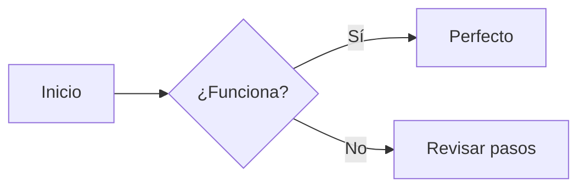
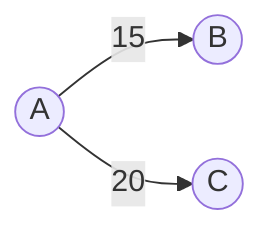

# Prueba rápida Mermaid

Este archivo es SOLO para comprobar que la vista previa de Mermaid funciona.

## 1. Diagrama mínimo


## 2. Grafo sencillo


Si este archivo NO se ve bien en la vista previa:
1. Asegúrate de que el bloque empieza EXACTO con ```mermaid (sin espacios antes)
2. Abre la paleta de comandos (Ctrl+Shift+P) y ejecuta:
   - "Markdown: Open Preview to the Side" (o en español según tu VS Code)
3. Si instalaste una extensión de Mermaid, prueba deshabilitarla temporalmente para ver si la vista previa nativa funciona.
4. Actualiza VS Code a la versión más reciente.
5. Como alternativa, copia uno de los bloques y pégalo en https://mermaid.live

Si esto sí funciona pero `diagrams.md` no, revisa que no haya un bloque sin cerrar más arriba.
